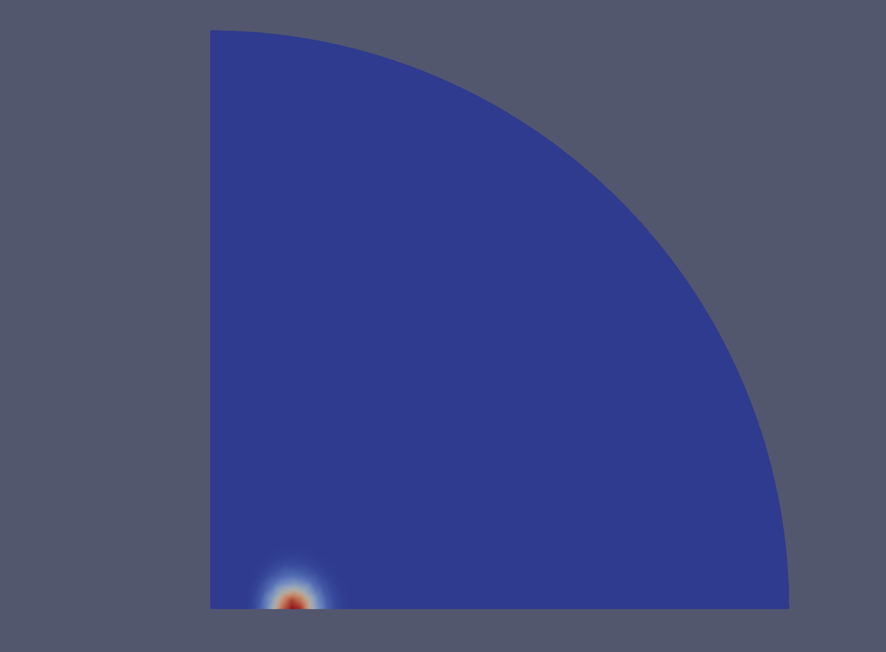
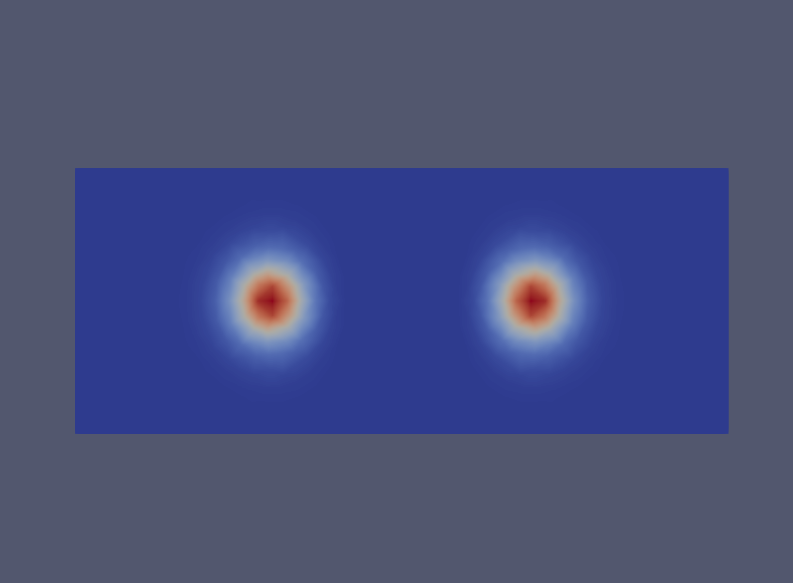
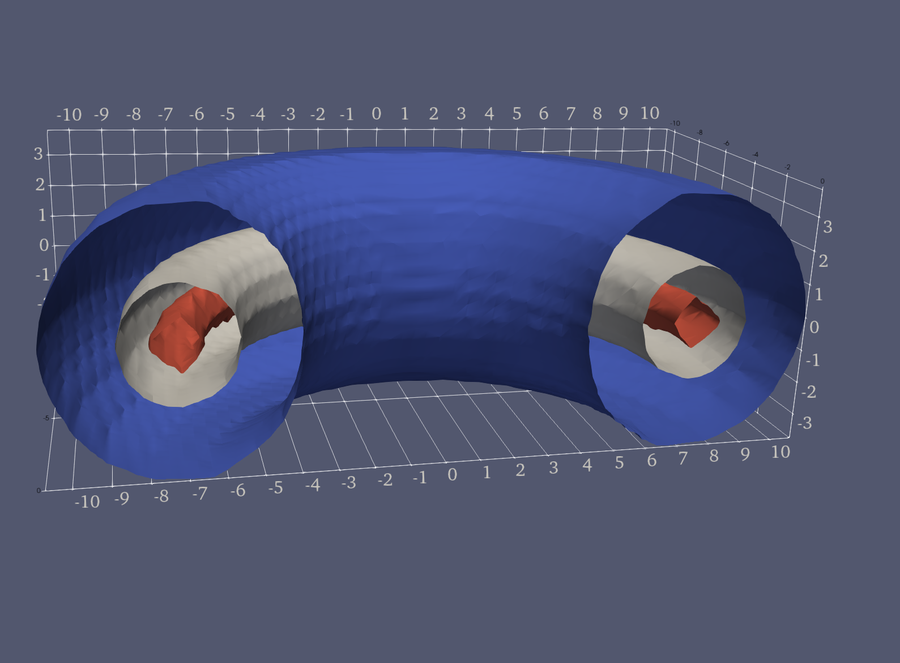
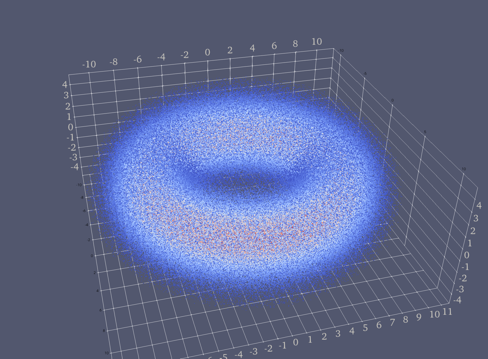

# Summary

Gothenburgh Einstein solver Collection (GECo) is a collection of solvers for stationary self-gravitating collisionless kinetic (so-called Vlasov) matter. 
Self-gravitating kinetic matter is used in modeling astrophysical systems such as galaxies, accretion disks and cosmologies, and is thus also of interest to work in fundamental relativity. 
Mathematically, the stationary equations form an integro-differential system of equations which may be solved for the gravitational field and the energy and momentum of the matter.
The gravitational interaction may be taken to be either Newtonian or general relativistic.
In solving these equations GECo makes use of a reduction method, finite elements, and adaptive mesh refinement.

# Statement of need

In understanding a physical model one usually starts with a simplified setting obtained by making certain assumptions, such as spherical symmetry, time-independence, collisionless particles etc. 
In the case of self-gravitating kinetic matter stationary solutions in the spherically symmetric setting are fairly well understood [@BinneyTremaine:2008, @Andreasson:2011].
However, many of the physical systems of interest require models beyond spherical symmetry. 
When going beyond spherical symmetry the coupled and nonlinear PDE systems in high dimensions such as the self-gravitating Vlasov equations are difficult to investigate analytically, and numerical approaches are essential to understand behavior of solutions and to answer questions of physical and mathematical interest.
The GECo code started with the desire to understand properties of stationary and axisymmetric solutions of the Einstein-Vlasov system. 

<!-- - unlike spherical symmetry, in axisymmetry the solution outside of the matter distribution is not canonical, and far-field boundary conditions must be applied.
- kinetic matter is of fundamental interest in gravitating systems and has played an important role in galactic models [@BinneyTremaine2008] and cosmology [@Ringstrom2017].
- Coupled and nonlinear PDE systems in high dimensions such as the self-gravitating Vlasov equations are difficult to investigate analytically, and numerical approaches are essential to understand behavior of solutions and to answer  questions of physical and mathematical interest.

We can cite stuff like this: [@amesAxisymmetricStationarySolutions2016] and [@amesCosmicStringBlack2019]. -->

# Method and implementation

To construct stationary solutions the code relies on a reduction method in which the distribution function for the matter is assumed to depend on the position and momentum phase-space coordinates solely through conserved quantities, such as the particle energy and angular momentum about the axis of symmetry. 
With this ansatz the Einstein--Vlasov or Vlasov--Poisson system (depending on the gravitational model used) forms a semi-linear integro-differential system of equations. 
In GECo, the form of the ansatz is called a `MaterialModel` and several different choices are implemented as subclasses of the dolfin Expression class within `geco/cppcode/`.
The semi-linear integro-differential system is solved via a mass-preserving fixed point scheme using Anderson acceleration. 
At each step of the fixed point method the linear system of equations is solved using finite elements implemented with the FEniCS toolkit [@Logg:2012]. 
Details of the mathematical formulation and implementation can be found in [@Ames:2016]

<!-- FIXME
- reduction based on method of [NAME] by which the distribution is a function of the conserved quantities. This results in a semilinear system of equations for the gravitational field.
- FEM (say something about implementation and limitations of the scheme (eg which FE are used, and does the code provide hte user with any flexibility.))
- Mass-preserving fixed point scheme to solve the nonlinear system of equations with Anderson acceleration. 
- Mesh refinement  -->

# Functionality
The entrypoint for GECo is a run script written in python. 
In this file the user selects the solver class (`EinsteinVlasovSolver` or `VlasovPoisson`) that specifies the model for the gravitational interaction, a `MaterialModel` to specify the particular form of the reduction ansatz, and in addition specifies several parameters related to the model and discretization. 
Running the script constructs a stationary solution via the fixed point scheme mentioned above, which has converged to the indicated tolerance.
Gravitational fields and matter quantities are saved in XMDF and XML format that can be consumed by Paraview as well as postprocessing scripts. 
Solutions may be constructed from multiple `MaterialModel`s by combining models in a weighted sum -- an example is given in `demos/ev_multi_component.py`. 

GECo includes several postprocessing routines to:

* Generate additional scalar data not computed during the fixed point iteration. 
* Extend the gravitational and matter fields as well as an ergoregion (if present) from the quarter plane computational domain to all of $\mathbb{R}^2$. 
* Extend the gravitational and matter fields as well as an ergoregion (if present) from the quarter plane computational domain to a volumetric representation in $\mathbb{R}^3$. 
* Represent the density as a three-dimensional point cloud. 
* Compute the Kretschmann curvature scalar.

Scripts for these postprocessing are found in `geco/bin/`

{ width=25% }
{ width=25% }
{ width=25% }
{ width=25% }

<!-- FIXME (examples of where and for what GECO has been used.)
- Stationary solutions based on EL-ansatz
- Multi-species solutions 
- Postprocessing routines and info, regarding ergoregions
- Newtonian gravity or general relativity. 
- point cloud representation
- Files saved to xmdf format, which can be viewed in Paraview -->

# Documentation

The documentation for GECo is published on the
[GECo GitLab pages](https://gitlab.com/alogg/geco).

# Limitations and future work

FIXME
- extension to spherical symmetry for completeness
- allow different particle species to have different properties such as mass
- extension to the Einstein-Vlasov-Maxwell system. 

<!-- # Acknowledgements

FIXME -->

# References
